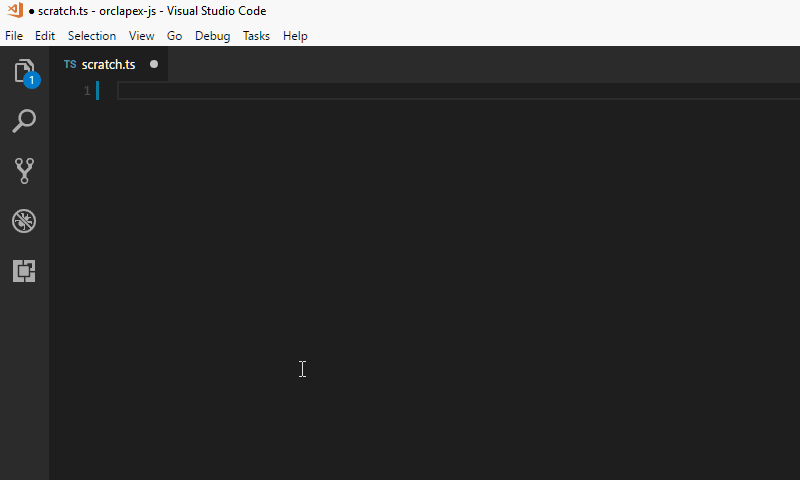
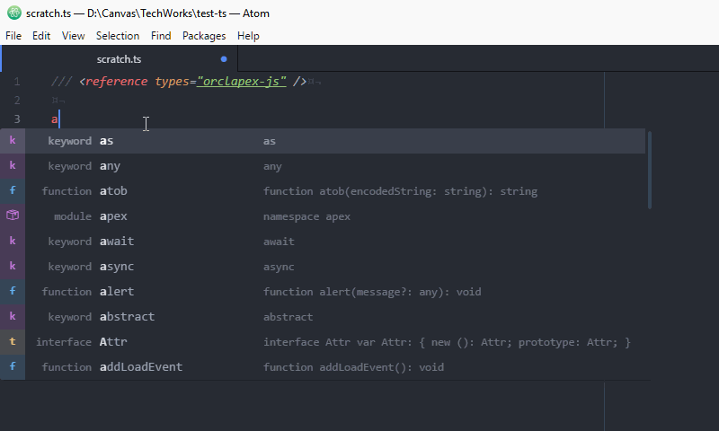
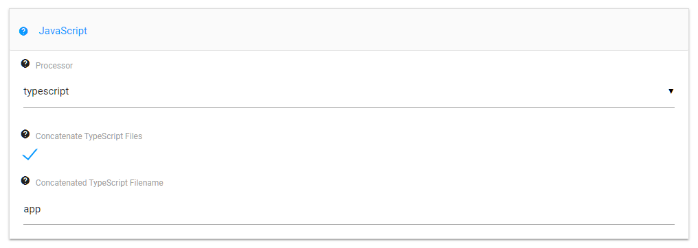

# TypeScript Definitions for Oracle Application Express JavaScript API
## Introduction
[TypeScript](https://www.typescriptlang.org) is a superset of JavaScript that introduces modern JS features and strongly-typed declarations that can be used to help reduce coding errors. TypeScript Declaration Files capture these definitions about third-party JavaScript libraries and/or modules, and are then used by the compiler for error-checking. Intergrated Development Environments (IDEs) that support TypeScript further enhance the developer experience by introducing features like error-highlighting and intellisense.

Intellisense support in [Visual Studio Code](https://code.visualstudio.com/):



Intellisense support in [Atom](https://atom.io/):



The definitions in this project are manually curated based on Oracle's official APEX documentation. More work is required to validate that the definitions against the source JavaScript files, and also to complete the JSDoc comments that support the intellisense code hints. The ultimate goal is to integrate these defintions for the Oracle Application Express (APEX) JavaScript API, into the [DefinitelyTyped](http://definitelytyped.org/) repository.

---
### IMPORTANT!
Please be mindful that this project is a **work-in-progress**. Please feel free to post issues and/or recommendations. If you would like to contribute to the project, please contact the [project owner](https://twitter.com/fuzziebrain).

---

## Software Requirements
* [Node.js](https://nodejs.org/) version 8.x (recommended)
* [TypeScript](https://www.typescriptlang.org/) version 2.x

To install TypeScript, run the following command after Node.js is installed:
```bash
$ npm install -g typescript
```

## Getting Started
1. Create the project folder.
2. Initialise the project:
```bash
$ npm init
```
3. Install the package from Git:
```bash
$ npm install --save-dev https://github.com/fuzziebrain/orclapex-js.git
```
4. Create a `tsconfig.json` file in the project root folder, containing at minimum, the following configuration:
```json
{
  "compilerOptions": {
    "module": "commonjs",
    "lib": [
      "es6",
      "dom"
    ]
  }
}
```
5. Add the reference to your TS file:
```typescript
/// <reference types="orclapex-js" />
```

For those who are not ready to start with TypeScript, Visual Studio Code provides type-checking and intellisense support. Add the following two lines of code:
```javascript
//@ts-check
/// <reference types="orclapex-js" />
```

## APEX Nitro Support for TypeScript
[APEX Nitro](https://github.com/OraOpenSource/apex-nitro) version 4 and later supports TypeScript. Instructions to set up the project configuration forthcoming.

